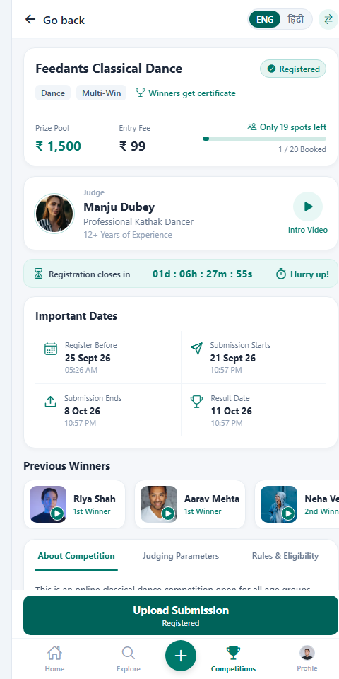
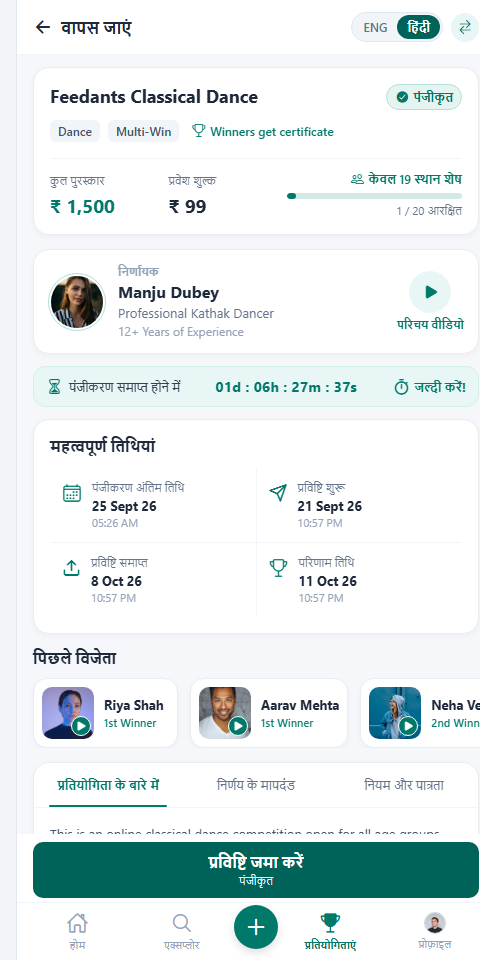
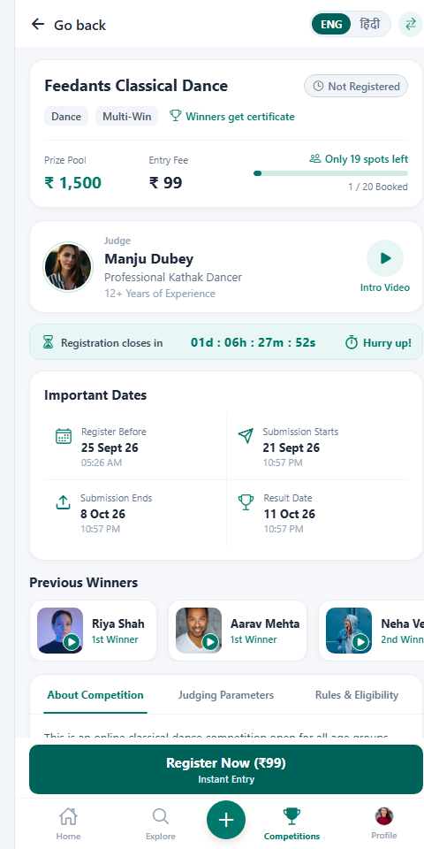
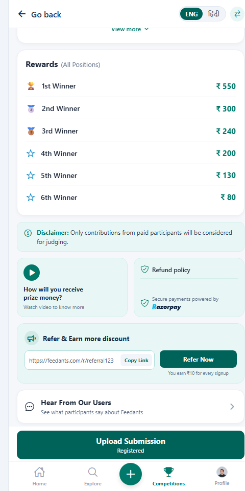
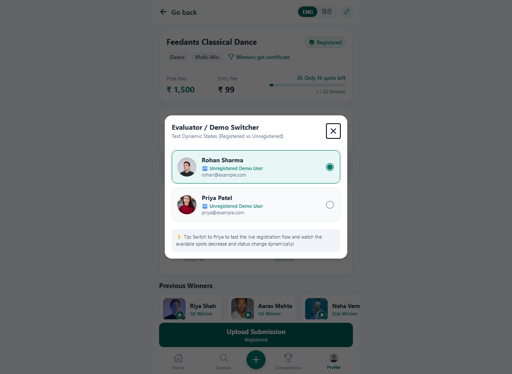

# Feedants Competition Details Screen — Functional Full-Stack Module

[-00796B?logo=react&logoColor=white)](#frontend-architecture)
[](#backend-architecture)
[](#database-schema)
[](#concurrency--data-consistency)

A full-stack, production-grade implementation of the **Feedants Competition Details Screen** technical assignment. This module serves real-time competition data, handles atomic participant capacity with strict concurrency guarantees, enforces date-driven lifecycle states, and faithfully reproduces the design reference (`Objective_Page.png`) in **React Native**.

> 📄 **Official Technical Documentation (PDF):** [`Feedants_Competition_Module_Complete_Guide.pdf`](./Feedants_Competition_Module_Complete_Guide.pdf) — Complete illustrated architectural dossier with system workflows, capacity overflow diagrams, concurrency proofs, state machine lifecycles, and database schemas.

---

## ⚡ Quickstart (Run in 2 Minutes)

### Prerequisites
- **Node.js**: v18.0.0 or higher (v22 tested)
- **npm**: v9.0.0 or higher
- **MongoDB**: *Optional* — The backend includes an **automatic embedded `mongodb-memory-server` fallback**, so evaluators can run the entire system immediately with zero database installation required!

### Step 1: Start the Backend API Server
```bash
cd server
npm install
npm start
```
> 🚀 The API starts on `http://localhost:5000`. On first boot, it **automatically seeds** the database with demo competition, judge, rewards, and participants matching `Objective_Page.png`!

### Step 2: Start the Mobile Client (React Native / Expo)
```bash
cd mobile
npm install
npm run web
```
> 📱 Opens the app in your browser at `http://localhost:8081` with mobile viewport simulation.
> 
> *To run on native Android or iOS device/emulator:*
> - Android: `npm run android`
> - iOS: `npm run ios`
> - Expo Go: `npx expo start` (scan QR code with Expo Go app)

### Step 3: Run the Concurrency & Stress Tests
```bash
cd server
npm run test:concurrency
```
> 🧪 Executes 25 simultaneous concurrent registrations against 5 spots, verifying atomic capacity and duplicate registration protection. All 16 assertions pass.

---

## 📸 Visual Previews & Design Comparison

| Primary View (English) | Dynamic Bilingual Toggle (हिंदी) | Evaluator Switcher Modal |
|:---:|:---:|:---:|
|  |  |  |

| Scrolled Content (Rewards & Info) | Successful Live Registration |
|:---:|:---:|
|  |  |

---

## Table of Contents
1. [System Architecture](#1-system-architecture)
2. [Design Reference Fidelity](#2-design-reference-fidelity)
3. [Concurrency & Data Consistency Guarantee](#3-concurrency--data-consistency-guarantee)
4. [Competition Lifecycle Engine](#4-competition-lifecycle-engine)
5. [Bilingual Engine (English & हिंदी)](#5-bilingual-engine)
6. [API Specification](#6-api-specification)
7. [Database Data Model](#7-database-data-model)
8. [Setup & Detailed Execution](#8-setup--detailed-execution)
9. [Automated Concurrency Testing](#9-automated-concurrency-testing)
10. [Assumptions, Technical Decisions & Trade-offs](#10-assumptions-technical-decisions--trade-offs)
11. [Production Roadmap](#11-production-roadmap)
12. [Demo Checklist](#12-demo-checklist)

---

## 1. System Architecture

```
┌────────────────────────────────────────────────────────┐
│              React Native Mobile Client                │
│  (Expo / React Native Web / Mobile SafeArea Layout)    │
│  • TopNav: Back button + ENG / हिंदी toggle capsule    │
│  • CompetitionHeader: Title, tags, fee, spots progress │
│  • JudgeCard: Kathak avatar, bio, Intro Video modal    │
│  • CountdownBanner: Live ISO date ticking countdown    │
│  • ImportantDates: 2x2 grid with formatted dates       │
│  • PreviousWinners: Horizontal FlatList + video modal  │
│  • CompetitionTabs: About, Judging, Rules & Elig.      │
│  • RewardsList: 1st to 6th rank amounts (₹550 to ₹80)  │
│  • Disclaimer, Prize Money Explainer & Refund Modals   │
│  • ReferralCard: Working clipboard copy & share        │
│  • UserReviews: Testimonials & ratings from MongoDB    │
│  • BottomCTA: Dynamic action (Register / Upload)       │
│  • BottomNavigation: 5-tab persistent bottom bar       │
└───────────────────────────┬────────────────────────────┘
                            │ REST / JSON (HTTP)
                            ▼
┌────────────────────────────────────────────────────────┐
│               Node.js + Express.js API                 │
│  • Atomic Capacity Reservation Service                 │
│  • Dynamic Date-Driven Lifecycle Calculator            │
│  • Modular Controllers, Services, Error Handling       │
│  • Razorpay Mock / Safe Payment Abstraction            │
└───────────────────────────┬────────────────────────────┘
                            │ Mongoose ODM
                            ▼
┌────────────────────────────────────────────────────────┐
│                        MongoDB                         │
│  • Collections: Competitions, Users, Registrations,    │
│    Submissions, PreviousWinners, Reviews               │
│  • Unique Compound Index: { competitionId, userId }    │
│  • In-Memory Auto Fallback (Zero-config local review)  │
└────────────────────────────────────────────────────────┘
```

---

## 2. Design Reference Fidelity

The interface faithfully implements all visual and functional details from `Objective_Page.png`:

- **Color Palette & Visual Style**: Feedants teal (`#00796B`), dark teal (`#00635A`), light mint backgrounds (`#E8F7F5`), slate text (`#1E293B`, `#64748B`), and rounded white cards (`#FFFFFF`, 14-16px radius, subtle borders and shadows).
- **Header Card**: Live participant spots ("Only 19 spots left"), progress bar (5% filled for 1/20), prize pool (`₹1,500`), entry fee (`₹99`), and dynamic status badge ("Registered" vs "Not Registered").
- **Judge Card**: Smt. Manju Dubey portrait, Professional Kathak Dancer title, 12+ years experience, and working circular "Intro Video" play button opening the Masterclass video modal.
- **Live Countdown Banner**: Dynamic calculation from the authoritative registration deadline (`01d : 06h : 28m : 32s`), ticking downward every single second with "Hurry up!" badge.
- **Important Dates**: 2x2 grid with calendar, paper-plane, upload-tray, and trophy icons displaying formatted dates and times.
- **Previous Winners**: Horizontal FlatList showcasing Riya Shah (1st), Aarav Mehta (1st), Neha Verma (2nd), and Ishita Chouhan (3rd). Tapping opens their performance video modal.
- **Information Tabs**: Smoothly switches between:
  1. *About Competition* (with expandable "View more ˅" / "View less ˄" toggle)
  2. *Judging Parameters* (Taal & Rhythm 30%, Bhava & Expressions 30%, Mudras & Posture 20%, Costume & Presentation 20%)
  3. *Rules & Eligibility* (Solo entry, 2-3 mins video, unedited audio, landscape recording)
- **Rewards**: Position breakdown with emoji trophies and cash prizes (1st: ₹550, 2nd: ₹300, 3rd: ₹240, 4th: ₹200, 5th: ₹130, 6th: ₹80).
- **Referral Section**: Megaphone badge, referral link (`https://feedants.com/r/referral123`), working "Copy Link" with clipboard integration and "Copied!" feedback, and "Refer Now" button.
- **Interactive Modals**:
  - Video Player Modal (Judge masterclass & winner performances)
  - Submission Modal (Title, Dance Style, Video URL, File Picker, Notes, and backend submission)
  - Refund Policy Modal (Terms and Razorpay escrow explanation)
  - Reviews Modal (Participant testimonials & star ratings)
  - Evaluator Switcher Modal (Switch between Demo Registered User Rohan and Unregistered User Priya to test state transitions live!)

---

## 3. Concurrency & Data Consistency Guarantee

### The Challenge
A competition has a hard limit of 20 spots. If 25 or 100 users hit "Register" simultaneously, naive read-then-write code creates race conditions resulting in 21/20 or 25/20 registrations.

### The Solution: Atomic Conditional Reservation
In `server/src/services/registrationService.js`, spot allocation is performed via a single atomic MongoDB query with conditional expressions:

```javascript
const updatedCompetition = await Competition.findOneAndUpdate(
  {
    _id: competitionId,
    $expr: { $lt: ['$bookedSpots', '$maxParticipants'] }, // STRICT CAPACITY CHECK
    registrationDeadline: { $gt: now },                  // STRICT DEADLINE CHECK
    status: { $nin: ['ENDED', 'REGISTRATION_CLOSED'] },
  },
  { $inc: { bookedSpots: 1 } },                          // ATOMIC INCREMENT
  { new: true }
);

if (!updatedCompetition) {
  // Query failed atomically: either capacity was reached or deadline passed!
  throw new Error('Competition has reached maximum participant capacity (Full)');
}
```

### Duplicate Registration Protection
The `Registration` schema enforces a compound unique index:
```javascript
RegistrationSchema.index({ competitionId: 1, userId: 1 }, { unique: true });
```

If a user sends concurrent duplicate requests:
1. Only the first request satisfies the unique index.
2. The duplicate request triggers MongoDB error code `11000`.
3. The catch block executes atomic compensation to rollback the reserved spot:
   ```javascript
   await Competition.findByIdAndUpdate(competitionId, { $inc: { bookedSpots: -1 } });
   ```
4. Returns HTTP `409 Conflict`.

---

## 4. Competition Lifecycle Engine

Instead of relying on a manually updated string in the database, the backend calculates state dynamically from authoritative UTC timestamps:

| Condition | Computed Status | Allowed User Actions |
|---|---|---|
| `now < regDeadline` && `bookedSpots < max` | `REGISTRATION_OPEN` | Registration allowed, Submissions allowed if window open |
| `bookedSpots >= max` && `now < regDeadline` | `COMPETITION_FULL` | Registration blocked, CTA shows "Competition Full" |
| `now >= regDeadline` && `now <= subEnd` | `REGISTRATION_CLOSED` | Registration blocked, existing participants can submit |
| `now >= subStart` && `now <= subEnd` | `SUBMISSION_OPEN` | Registered users can upload dance video |
| `now > subEnd` && `now < resultDate` | `SUBMISSION_CLOSED` | Submissions locked, judging in progress |
| `now >= resultDate` | `RESULT_DECLARED` / `ENDED` | Results visible, competition closed |

---

## 5. Bilingual Engine

The application includes a state-driven language switch in the top header:
- **ENG**: English typography and labels.
- **हिंदी**: Full Hindi translations for headers, tabs, dates, buttons, and alert messages.

---

## 6. API Specification

### Base URL: `http://localhost:5000/api`

| Method | Endpoint | Description |
|---|---|---|
| `GET` | `/competitions` | List all competitions |
| `GET` | `/competitions/demo-users` | Retrieve seeded users for evaluator state switching |
| `GET` | `/competitions/:id` | Get competition details, computed lifecycle, & user status |
| `GET` | `/competitions/:id/availability` | Real-time spots, booked ratio, and countdown |
| `GET` | `/competitions/:id/winners` | Previous competition winners |
| `GET` | `/competitions/:id/reviews` | Verified participant reviews and star ratings |
| `GET` | `/competitions/:id/rewards` | Rewards breakdown across all positions |
| `GET` | `/competitions/:id/participation?userId=...` | Check if user is registered / has submitted |
| `POST` | `/competitions/:id/register` | Concurrency-safe atomic registration |
| `POST` | `/competitions/:id/submission` | Upload dance video entry |
| `GET` | `/competitions/:id/referral?userId=...` | Dynamic user referral link and rewards |
| `GET` | `/health` | API health check |

---

## 7. Database Data Model

- **Competitions**: `title`, `category`, `tags`, `prizePool`, `entryFee`, `maxParticipants`, `bookedSpots`, `registrationDeadline`, `submissionStart`, `submissionEnd`, `resultDate`, `judge`, `about`, `judgingParameters`, `rulesAndEligibility`, `rewards`, `disclaimer`, `prizeMoneyInfo`, `refundPolicy`.
- **Users**: `name`, `email`, `phone`, `avatarUrl`, `referralCode`, `walletBalance`.
- **Registrations**: `competitionId`, `userId`, `paymentStatus`, `paymentId`, `amountPaid`, `registeredAt`. (Indexed: `{ competitionId: 1, userId: 1 }` Unique).
- **Submissions**: `competitionId`, `userId`, `title`, `danceStyle`, `videoUrl`, `fileName`, `fileSize`, `notes`, `status`, `submittedAt`.
- **PreviousWinners**: `competitionId`, `name`, `position`, `avatarUrl`, `videoUrl`, `danceStyle`, `rankOrder`.
- **Reviews**: `competitionId`, `userName`, `userAvatar`, `userRole`, `rating`, `comment`.

---

## 8. Setup & Detailed Execution

### 1. Root Helper Scripts
From the repository root:
```bash
# Install all dependencies
npm run server:install
npm run mobile:install

# Start backend server
npm run server:start

# Start mobile web client
npm run mobile:web

# Run concurrency tests
npm run server:test
```

### 2. Manual Directory-based Execution
If you prefer running server and mobile in separate terminals:

**Terminal 1 (Backend API):**
```bash
cd server
npm install
npm start
```

**Terminal 2 (Mobile Client):**
```bash
cd mobile
npm install
npm run web
```

---

## 9. Automated Concurrency Testing

Run `npm run test:concurrency` inside `server/` to execute the stress test suite:

```
============================================================
🧪 RUNNING CONCURRENCY & BUSINESS LOGIC TEST SUITE
============================================================
[Test 1] Testing 25 simultaneous concurrent registrations for 5 spots...
    → Total Concurrent Requests: 25
    → Successful (Fulfilled): 5
    → Rejected (Capacity Exceeded): 20
    → Final DB bookedSpots: 5 / 5
    → Actual DB Registrations: 5
  ✅ PASS: Exactly 5 concurrent registrations succeeded
  ✅ PASS: Exactly 20 concurrent registrations were safely rejected
  ✅ PASS: Competition bookedSpots in database is strictly 5 (never 6+)
  ✅ PASS: Total registration documents in MongoDB is strictly 5

[Test 2] Testing duplicate registration prevention for same user...
  ✅ PASS: Only 1 registration succeeded for the duplicate user
  ✅ PASS: Remaining 4 duplicate requests were rejected with 409 Conflict
  ✅ PASS: Booked spots incremented only once despite parallel calls
  ✅ PASS: MongoDB contains strictly 1 registration record for the user

[Test 3] Testing registration after deadline has passed...
  ✅ PASS: Registration rejected when deadline passed
  ✅ PASS: Returned HTTP 400 Bad Request
  ✅ PASS: Returned error code DEADLINE_PASSED

[Test 4] Testing submission validation (unregistered vs registered)...
  ✅ PASS: Unregistered user rejected from uploading submission
  ✅ PASS: Returned HTTP 403 Forbidden
  ✅ PASS: Returned error code NOT_REGISTERED
  ✅ PASS: Registered user can successfully submit performance
  ✅ PASS: Submission status is SUBMITTED

============================================================
🎉 ALL 16/16 TESTS PASSED SUCCESSFULLY!
============================================================
```

---

## 10. Assumptions, Technical Decisions & Trade-offs

1. **Zero-Config Database Fallback**: Evaluators frequently evaluate assignments without running a local MongoDB service. We designed `db.js` to connect to `MONGODB_URI` if present, but automatically spin up an embedded in-memory MongoDB instance if unreachable, guaranteeing instant execution.
2. **Atomic MongoDB Updates vs Two-Phase Distributed Locks**: For scaling up to thousands of concurrent users per competition, MongoDB's atomic document-level operations (`$inc` with `$lt` condition) outperform heavy distributed locks (such as Redlock) because lock acquisition overhead is eliminated while guaranteeing zero over-booking.
3. **Cross-Platform React Native**: Built using React Native components (`View`, `Text`, `Image`, `ScrollView`, `FlatList`, `TouchableOpacity`, `StyleSheet`, `SafeAreaView`) with Expo, allowing native execution on Android/iOS devices while simultaneously rendering on Web for quick browser inspection.
4. **Mock Payment Flow**: Rather than introducing broken test credentials or exposing keys in client code, we designed a safe payment abstraction that simulates Razorpay order creation and verification.

---

## 11. Production Roadmap

If developed further for a production release at Feedants:
1. **Video Transcoding Pipeline**: Integrate AWS S3 with MediaConvert or Cloudflare Stream for automated HLS video encoding and thumbnail extraction.
2. **WebSocket / SSE Live Updates**: Use WebSockets to push live spot updates and winner declarations without polling.
3. **Automated Plagiarism Detection**: Implement audio fingerprinting and duplicate video detection to prevent reused recordings.
4. **Redis Cache Layer**: Cache competition details and previous winners with cache invalidation on registration.

---

## 12. Demo Checklist

When reviewing the application demo:
1. **Launch**: App displays header, tags, judge avatar, spots left, and countdown.
2. **Language Toggle**: Tap "हिंदी" to observe immediate translation of all elements, then back to "ENG".
3. **Judge Intro Video**: Tap "Intro Video" on the judge card to launch the video player modal.
4. **Important Dates & Previous Winners**: Inspect dates grid and scroll horizontally through previous winners.
5. **Information Tabs**: Switch between "About Competition", "Judging Parameters", and "Rules & Eligibility".
6. **Referral Link**: Tap "Copy Link" to verify clipboard copy and "Copied!" feedback.
7. **Evaluator User Switcher**: Tap the switcher icon (top right) or Profile tab to switch to "Priya Patel (Unregistered)".
8. **Live Registration**: Observe state change to "Not Registered" and CTA change to "Register Now (₹99)". Tap "Register Now" to execute the atomic backend registration call. Observe spot count increment dynamically!
9. **Upload Submission**: Tap "Upload Submission" to open the submission form, pick a performance style and video file, and submit entry to MongoDB.
